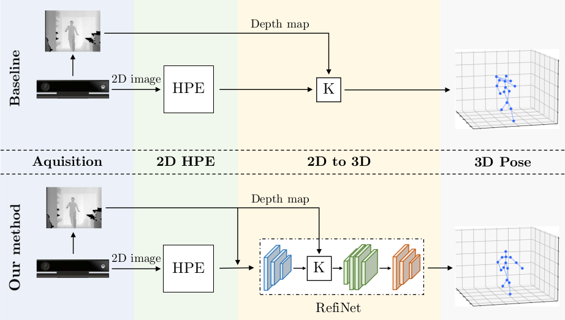
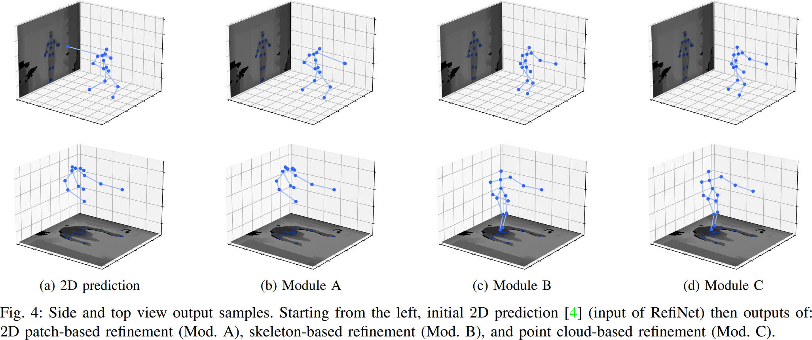

<h1 align="center">RefiNet: 3D Human Pose Refinement with Depth Maps</h1>

This is the official PyTorch implementation of the publication:

*A. D’Eusanio, S. Pini, G. Borghi, R. Vezzani, R. Cucchiara*  
**RefiNet: 3D Human Pose Refinement with Depth Maps**  
*In International Conference on Pattern Recognition (ICPR) 2020*

**[[Paper](https://iris.unimore.it/retrieve/handle/11380/1212262/282582/ICPR_2020_Human_Pose_Estimation_compressed.pdf "D'Eusanio et al., RefiNet: 3D Human Pose Refinement with Depth Maps, ICPR 2020")]  [[Project Page](https://aimagelab.ing.unimore.it/go/3d-human-pose-refinement "3D Human Pose Estimation and Refinement")]**

Human Pose Estimation is a fundamental task for many applications in the Computer Vision community and it has 
been widely investigated in the 2D domain, i.e. intensity images.
Therefore, most of the available methods for this task are mainly based on 2D Convolutional Neural Networks and 
huge manually annotated RGB datasets, achieving stunning results. 
In this paper, we propose RefiNet, a multi-stage framework that regresses an extremely-precise 3D human pose estimation 
from a given 2D pose and a depth map. The framework consists of three different modules, each one specialized in a 
particular refinement and data representation, i.e. depth patches, 3D skeleton and point clouds.
Moreover, we present a new dataset, called Baracca, acquired with RGB, depth and thermal cameras and specifically created 
for the automotive context. 
Experimental results confirm the quality of the refinement procedure that largely improves the human pose estimations of off-the-shelf 2D methods.

<p align="center" width="100%">
  
</p>
<p align="center" width="100%">
  
</p>

## Getting Started
These instructions will give you a copy of the project up and running on your local machine for development and testing 
purposes. There isn't much to do, just install the prerequisites and download all the files.

### Prerequisites
Things you need to install to run the code:

```
Python >= 3.6.7
PyTorch >= 1.6
```

Install [CUDA](https://developer.nvidia.com/cuda-zone) and [PyTorch](https://pytorch.org/) following the main website directive.

Run the command:
```
pip install requirements.txt
```

## Download datasets
The employed datasets are publicy available: 
- **[Itop](https://zenodo.org/record/3932973#.X5vuVYhKguU "Towards Viewpoint Invariant 3D Human Pose Estimation ITOP")**
- **[Baracca](https://aimagelab.ing.unimore.it/go/baracca "Baracca Dataset")**

Once downloaded, unzip anywhere in your drive.

## Baseline keypoints and pretrained model
Baseline keypoints are available at this [link](https://drive.google.com/drive/folders/1ThsVoHuJ5D_WFhu9JXPzso8LKVnxvJ9l?usp=sharing).
Pretrained pytorch models will be soon available at the same link.

## Setup configuration
For this project we used a json file, located in the hypes folder, such as:  
`hypes/baracca/depth/test.json`

In there, you can set several parameters, like:

- **train_dir**, path to training dataset.
- **phase**, select if training or testing, can either add it on config or as added parameter (see below).
- **Data-type**, select the type of data for training, depth 2D, 3D joints, 3D poitclouds.
- **from_gt**, choose if training from gt with high gaussian noise.
- **sigma**, gaussian noise sigma value.
- **mu**, gaussian noise mu value.

For every other information check the file.

## Usage
```
python main.py --hypes hypes/itop/depth/train.json
```
- `--hypes`, path to configuration file.
- `--phase`, train or test phase.

## Authors

* **Andrea D'Eusanio** - [Deusy94](https://github.com/Deusy94)
* **Stefano Pini** - [stefanopini](https://github.com/stefanopini)
* **Guido Borghi** - [gdubrg](https://github.com/gdubrg)
* **Roberto Vezzani** - [robervez](https://github.com/robervez)
* **Rita Cucchiara** - [Rita Cucchiara](https://aimagelab.ing.unimore.it/imagelab/person.asp?idpersona=1)

## Ciatation
If you use this code, please cite our paper:
```
@inproceedings{deusanio2020refinet,
  title={{RefiNet: 3D Human Pose Refinement with Depth Maps}},
  author={D'Eusanio, Andrea and Pini, Stefano and Borghi, Guido and Vezzani, Roberto and Cucchiara, Rita},
  booktitle={International Conference on Pattern Recognition (ICPR)},
  year={2020}
}
```

## License

This project is licensed under the MIT License - see the [LICENSE](LICENSE) file for details
